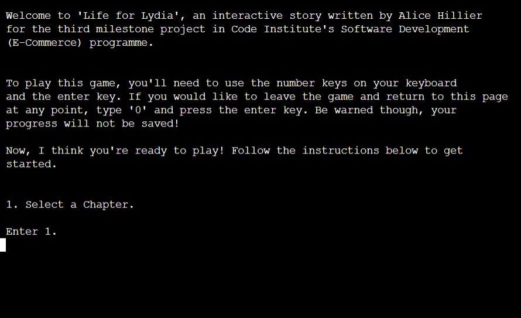
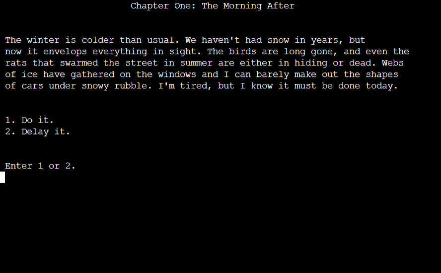

# **Life for Lydia**


[Visit my website here](https://life-for-lydia-bf0c0403fae6.herokuapp.com/)

1. [Introduction](https://github.com/alicehillier/life-for-lydia/#introduction)

2. [UX Design](https://github.com/alicehillier/life-for-lydia/#ux-design)

    i. [Strategy Plane](https://github.com/alicehillier/life-for-lydia/#strategy-plane)

    ii. [Scope Plane](https://github.com/alicehillier/life-for-lydia/#scope-plane)
    
    iii. [Structure Plane](https://github.com/alicehillier/life-for-lydia/#structure-plane)

    iv. [Skeleton Plane/Wireframes](https://github.com/alicehillier/life-for-lydia/#skeleton-plane)

    v. [Surface Plane](https://github.com/alicehillier/life-for-lydia/#surface-plane)

3. [Features](https://github.com/alicehillier/life-for-lydia/#features)

    i. [Existing Features](https://github.com/alicehillier/life-for-lydia/#existing-features)

    ii. [Features to be implemented in the future](https://github.com/alicehillier/life-for-lydia/#features-to-be-implemented-in-the-future)

4. [Technology Used](https://github.com/alicehillier/life-for-lydia/#technology-used)

    i. [Main Languages](https://github.com/alicehillier/life-for-lydia/#main-languages)

    ii. [Frameworks, Libraries and Programmes](https://github.com/alicehillier/life-for-lydia/#frameworks-libraries-and-programmes)

5. [Issues and Bugs](https://github.com/alicehillier/life-for-lydia/#issues-and-bugs)

6. [Deployment](https://github.com/alicehillier/life-for-lydia/#deployment)

7. [Testing](https://github.com/alicehillier/life-for-lydia/#testing)

8. [Credits](https://github.com/alicehillier/life-for-lydia/#credits)

9. [Acknowledgements](https://github.com/alicehillier/life-for-lydia/#acknowledgements)


## **Introduction**

Welcome to *Life for Lydia*, an interactive, terminal-based story powered by Python. Consisting of two chapters, the 
interactive story is designed for readers and gamers alike. Choose your own path and make important decisions
to discover more.

*Life for Lydia* is an interactive story made with Python, created by Alice Hillier for the third project in Code 
Institute’s Diploma in Software Development programme.

[Back to top](https://github.com/alicehillier/life-for-lydia/#life-for-lydia)

## **UX Design**

### **Strategy Plane**

In order to gauge what makes a successful interactive story, I drew on my own experience of reading books like
*Goosebumps* and playing games like the more recent editions of *Assassin's Creed* and *Telltale's The Walking Dead*.  

#### **Goosebumps**


The above image was sourced from [Amazon](https://www.amazon.co.uk/Goosebumps-Books-Collection-Classic-Covers/dp/1407181963/ref=sr_1_1?keywords=goosebumps+books&qid=1692560994&sprefix=goosebumps%2Caps%2C61&sr=8-1).

-	Offered meaningful choices to the reader.
- Players turned to the page indicated based on their choice.

#### **Assassin's Creed**


The above image was sourced from [Ubisoft](https://store.ubisoft.com/uk/assassin-s-creed--odyssey---ultimate-edition/5afda8aa6b54a4271407a877.html?ucid=UWB-ID_151373&maltcode=__UWB_ubisoft.com_______&addinfo=_global%20navigation_entity%20pages__game%20-%20assassins%20creed%20odyssey_global%20nav_global%20nav_action_shop%20:%20shop%20by%20game%20:%20assassins-creed-odyssey_).

- Offered meaningful choices to the player.
- The main story remained the same, with alterations according to the players' choices.
- Making certain choices affected the character's relationships, revealed new information and impacted the lives of 
other characters.

#### **The Walking Dead**


The above image was sourced from [IGN](https://www.ign.com/games/the-walking-dead-the-telltale-definitive-series).

- Offered meaningful choices to the player.
- The main story remained the same, with alterations according to the players' choices.
- Making certain choices affected the character's relationships and future opportunities.

### **User Stories**

#### **First-Time Visitor Goal**

- I want to learn how to to play the game/interact with the story.
- I want to be able to quit.
- I want to make decisions.
- I want the text to presented to me clearly.

#### **Returning Visitor Goal**

- I want to select the next chapter.
- I want to replay the story and make different choices.
- I want to see the consequences of my decisions.

#### **Frequent Visitor Goal**

- I want to experience all of the possible outcomes.
- I want to find out new information by making a different choice.	

[Back to top](https://github.com/alicehillier/life-for-lydia/#life-for-lydia)

### **Scope Plane**

Based on the research conducted in the Strategy Plane, I decided to include the following features in the *Life for 
Lydia* interactive story:

- A main menu, which includes the title, instructions about how to play, and a contents menu.
- Two chapters, allowing the user to explore more of the story.

I ensured that I met the following functionality requirements:

- Each line of text fits within the terminal for optimal user experience.
- User inputs are responded to correctly.
- Errors caused by user input are dealt with appropriately.

[Back to top](https://github.com/alicehillier/life-for-lydia/#life-for-lydia)

### **Structure Plane**

The contents of the interactive story were carefully considered and selected for their relevance and usefulness to users.

The project itself is contained within one file, and sections are clearly labelled with a comment.
- **Imports**: At the top of the file, imports are described with their specific purpose in the program.
- **Important Functions**: Next, important functions that are key to the program's execution are defined.
- **Main Menu Content**: Following this is the main menu content, made up of introduction and story_selector functions.
- **Chapter One**: After the main menu content, the code for Chapter One is laid out.
- **Chapter Two**: Finally, the code for Chapter Two is written beneath Chapter One.

[Back to top](https://github.com/alicehillier/life-for-lydia/#life-for-lydia)

### **Skeleton Plane**

When starting to design my story, I created detailed stories using Google Docs, and flow diagrams using Figma, to map out both chapters of the story. 
To view the written chapters and the flow diagrams, please click on the links below:

- [Chapters 1 & 2](documents/images/life-for-lydia-story.pdf)
- [Flow Diagrams](documents/images/life-for-lydia-flow-diagrams.pdf)

[Back to top](https://github.com/alicehillier/life-for-lydia/#life-for-lydia)

### **Surface Plane**

After establishing the content of the interactive story, I began putting together the aesthetics. 

- Dictionaries are formatted as clean text when displayed to the user.
- Time and dates are formatted in an easy-to-read way when displayed to the user.
- Ample spacing is provided throughout the program for clarity.
- A consistent decision format is used to ensure the experience is seamless for the user.

[Back to top](https://github.com/alicehillier/life-for-lydia/#life-for-lydia)

## **Features**

### **Existing Features**

1. A title page, displayed with large graphics. "Loading..." appears in the bottom left corner while a 5 second delay executes, 
allowing ample time for the user to read the title.


2. An introduction section, containing information about the app and its instructions. This section contains important information
about how to exit the game and restart the app.



3. Two chapters to choose from, which fleshes out the story and provides the user with more opportunities to interact. The ability to choose
their preferred chapter will prevent the user from becoming bored if they have to endure the same experience just to move forward with the story.


4. Frequent choices which allow the user to obtain more information about, or influence the outcome of, the story depending
on their decisions.



5. The 'exit' option, which is available at every decision point and returns the user to the title page and then the introduction section. 
Once '0' has been entered by the user, "Looking for the right page..." is printed to the console, followed by a short delay. "Aha! Found it!" 
is then printed to the console before the user is redirected to the title page.


6. Error statements, designed to address invalid user inputs in a simple, readable way. 

    i. The error statement displayed when the user input contains alphabet characters:

    

    ii. The error statement displayed when the user input is made up of spaces, or nothing is entered at all:

     

    iii. The error statement displayed when the user input is not a valid option and does not qualify for either of the statements above:

    

### **Features to be implemented in the future**

The following features would be an excellent means of creating a fuller experience for the user:

1. More chapters.

2. Long-term consequences of your decisions.

3. The option to save your progress.

[Back to top](https://github.com/alicehillier/life-for-lydia/#life-for-lydia)

## **Technology Used**

### **Main Languages**

- Python

### **Frameworks, Libraries and Programmes**

- Google Docs: I used this to write out the story.
- Figma: I used this to create detailed flow diagrams for the story.
- Visual Studio Code: I used this local editor to write and edit my code.
- Git: I committed and recorded my work using Git.
- Github: I stored my work on Github and recorded its development.
- Heroku: I deployed my app on Heroku.

[Back to top](https://github.com/alicehillier/life-for-lydia/#life-for-lydia)

## **Issues and Bugs**

1.  Issue: There was an issue with setting a timeout before returning to the main menu after '0' was entered by the user. 
    An error showed that I was attempting to apply the sleep method to a string.
    
    Solution: I realised that I had declared 'time' as variable for the current time, which is displayed in Chapter Two.
    To fix the issue, I simply changed the variable name to 'time_now'. The sleep method then applied to 'time' with no 
    problems.

2.  Issue: There was a lot of repetitive code which was impacting readability. This was especially noticeable at the 
    decision point within each of the story's functions.

    Solution: After a lot of online research about how to create a reusable function for this specific purpose, I finally 
    was able to figure out how use the reusable make_decision function by passing dictionaries with the same name as its 
    argument. By using the same numbers to represent a different decision in each dictionary, the code could be applied 
    in any circumstance where the dictionary is called 'options', has strings assigned to numbers 1 and 2, and functions 
    assigned to numbers 3 and 4.

3.  Issue: At decision points where only one option is available, the make_decision function could not be applied. The 
    code was still repetitive.

    Solution: Using the code from make_decision, I applied the same logic to create a function called go_to_next_step,
    which took the same argument of 'options' for consistency. The only changes necessary were to the calling of items 
    in the dictionary. Instead of having 4 numbers, there were only 2 required. The first would be the string, which 
    would be displayed to the user as a print statement, and the second number would be the function.

4.  Issue: The code contained a lot of print statements, which I had used to separate lines when they are being
    displayed to the user. This made the code very heavy and less readable.

    Solution: I removed a majority of the print statements and instead continued one long print statement across 
    several lines. For clarity, I ensured that the lines were not excessively long and were well-structured. I regularly
    used '\n' as well as breaking the lines in the code so that is would be easy to read.

5.  Issue: The echoing of user input in the console made the appearance of the story confusing and difficult to read. 

    Solution: Having done some research online, I found that getpass was a suitable fix, as the user's input would not
    be printed to the console. I replaced all inputs with getpass, which greatly improved readability and produced a
    cleaner look.

6.  Issue: User feedback suggested that the instructions in the introduction weren't clear enough, as it was only 
    mentioned that the number keys were needed. In fact, the user is required to type a valid number and then press the
    'enter' key.

    Solution: I updated the instructions paragraph in the introduction function, providing more clarity and a better
    user experience.

### **Unresolved Issues and Bugs**

1.  Issue: The typewriter effect I had in place for the story could easily be interrupted by user input. While I could 
    pause user input while the text was printing to the console, this would result in all user inputs being queued. This
    also means that if the user entered a valid answer before reading the question, they would immediately be directed
    to the next step in the story once the text was finished printing. This would dramatically affect the user's 
    experience and may cause confusion.

    Solution: After a lengthy attempt to find a resolution, I decided to remove the typewriter effect as its negative
    impact on user experience outweighed the pleasant aesthetics.

[Back to top](https://github.com/alicehillier/life-for-lydia/#life-for-lydia)

## **Deployment**

The project was developed using Visual Studio Code as the code editor, committed to Git as a local repository, and then 
pushed to GitHub for storage. It was then deployed to Heroku.

### **Deployment to Heroku**

This project was deployed to Heroku by taking the following steps:

1. Click on 'New'.
2. Enter a name for the app, select a region and click 'Create'.
3. Go to Settings.
4. In Settings, scroll down to Config Vars and click 'Reveal Config Vars'.
5. In the KEY field, enter 'PORT'. In the VALUE field, enter '8000'.
6. Return to Settings.
7. In Settings, scroll down to Buildpacks and add the following buildpacks in the order provided: 
- `heroku/python`
- `heroku/nodejs`
8. Go to Deploy.
9. In the 'Deployment Method' section, select GitHub and connect to your GitHub account.
10. Search for your repository and connect to it.
11. Enable automatic deploys if you are continuing to work on your app.
12. Finally, deploy branch and watch Heroku do its magic! 

[Click here](https://devcenter.heroku.com/articles/git) for more information about different deployment methods with Heroku.

### **Forking the GitHub Repository**

By forking the GitHub repository you can make a copy of the original repository on your GitHub account. You can view and/or make changes to this copy, without affecting the original repository, by using the following steps:

1. Log in to GitHub.
2. Navigate to the main page of the GitHub Repository that you want to fork.
3. At the top right of the Repository, just below your profile picture, find the "Fork" button.
4. You should now have a copy of the original repository in your GitHub account.
5. Changes made to the forked repository can be merged with the original repository via a pull request.

### **Making a Local Clone**

By cloning a GitHub Repository, you can create a local copy on your computer of the remote repository. This allows you to make all of your edits locally, rather than directly in the source files of the origin repository, by using the following steps:

1. Log in to GitHub
2. Navigate to the main page of the GitHub Repository that you want to clone.
3. Above the list of files, click on the dropdown item called "Code".
4. To clone the repository using HTTPS, copy the link under "HTTPS".
5. Open Git Bash.
6. Change the current working directory to the location where you want the cloned directory to be made.
7. Type `git clone`, and then paste the URL you copied in Step 4.

```
$ git clone https://github.com/YOUR-USERNAME/YOUR-REPOSITORY
```

8. Finally, press Enter. Your local clone has now been created.

```
$ git clone https://github.com/YOUR-USERNAME/YOUR-REPOSITORY
> Cloning into `CI-Clone`...
> remote: Counting objects: 10, done.
> remote: Compressing objects: 100% (8/8), done.
> remove: Total 10 (delta 1), reused 10 (delta 1)
> Unpacking objects: 100% (10/10), done.
```

Changes made on the local machine (cloned repository) can be pushed to the upstream repository directly if you have a write access for the repository. Otherwise, the changes made in the cloned repository are first pushed to the forked repository, and then a pull request is created.

[Click Here](https://docs.github.com/en/github/creating-cloning-and-archiving-repositories/cloning-a-repository-from-github/cloning-a-repository) for a more comprehensive guide on how to complete the above process.

[Back to top](https://github.com/alicehillier/life-for-lydia/#life-for-lydia)

## **Testing**

[Click here to view all testing documentation](https://github.com/alicehillier/life-for-lydia/blob/main/README-testing.md)

## **Credits**

- My husband, Norman, for his constant support.
- My friends and family for testing my app repeatedly.

## **Acknowledgements**

- ChatGPT: for explaining console errors I faced in simple terms.
- [https://www.codingninjas.com/](https://www.codingninjas.com/studio/library/how-to-clear-a-screen-in-python#:~:text=There%20are%20several%20commands%20that,to%20clear%20the%20shell%2Fterminal.): for explaining how to clear the console depending on which operating system is being used.
- [https://patorjk.com/software/taag/](https://patorjk.com/software/taag/#p=display&f=Graffiti&t=Type%20Something%20): for creating the title graphics.

[Back to top](https://github.com/alicehillier/life-for-lydia/#life-for-lydia)